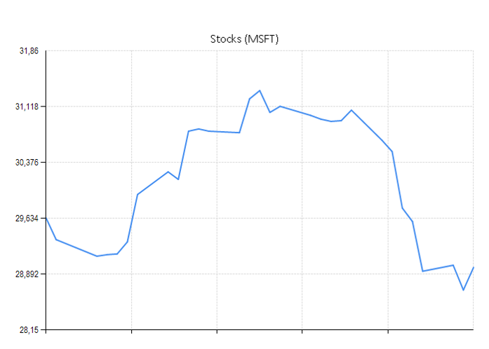
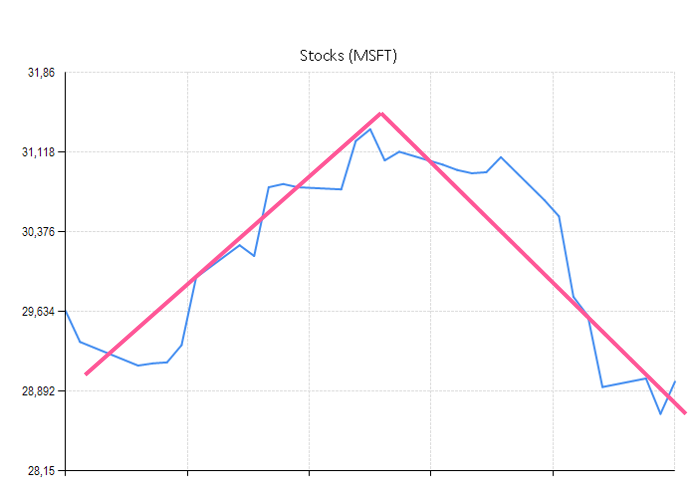

- title : Capturing domain logic in F#
- description : From types to domain specific languages
- author : Tomas Petricek
- theme : white
- transition : none

****************************************************************************************************

# Capturing domain logic in F#

## Domain specific languages

Tomas Petricek 
[www.fsharpworks.com](http://www.fsharpworks.com)

----------------------------------------------------------------------------------------------------

# Expressing _intent_ with F#

----------------------------------------------------------------------------------------------------

# Expressing intent with F#

 - Understand what _code means_
 - Build _complex logic_ from _simple_
 - Compose _correct code_ from correct blocks
 - Using _types_ for enforcing correctness

----------------------------------------------------------------------------------------------------

# Expressing intent with F#

## Repeated functional theme

 - _Domain modelling_ with types
 - Building _domain-specific languages_
 - Choosing the right _representation_

## No silver bullet

 - Not a pattern or style, but a way of thinking

----------------------------------------------------------------------------------------------------

# Applies at multiple levels

 - Defining _data types_ in business domain
 - Choosing async or reactive _abstractions_
 - Processing data with _active patterns_
 - Composing _functions_ in functional style
 - Specifying machine learning _features_

****************************************************************************************************

# Case I
## Parsing Markdown documents

----------------------------------------------------------------------------------------------------

## Inline Markdown formatting

    type MarkdownSpan =
      | Literal of string
      | InlineCode of string
      | Hyperlink of MarkdownSpans * string

    and MarkdownSpans = list<MarkdownSpan>

## Sample Markdown document

    [lang=text]
    The most important F# keyword is `let`, for more
    information see [F# web site](http://fsharp.org).

----------------------------------------------------------------------------------------------------

# Two places for domain modelling

## Representing the document

 - What formatting is _available_?
 - How are elements _nested_?

## Parsing the document

 - Built-in F# _active patterns_
 - Custom _functions and operators_

----------------------------------------------------------------------------------------------------

## Parsing using pattern matching

    match chars with
    | StartsWith [' '; ' '; '\n'; '\r'] chars
    | StartsWith [' '; ' '; '\n' ] chars
    | StartsWith [' '; ' '; '\r' ] chars ->
        HardLineBreak

## Parsing using function composition

    [lang=fsharp]
    [ ( startsWith [' '; ' '; '\n'; '\r'] <|>
        startsWith [' '; ' '; '\n' ] <|>
        startsWith [' '; ' '; '\r' ] )
      |> map (fun _ -> [HardLineBreak])

----------------------------------------------------------------------------------------------------

# Language vs. combinators

## Common question

 - List comprehensions _vs._ functions
 - Active patterns _vs._ parser combinators
 - Computation expressions _vs._ functions

## How to choose

 - Reusing language may be _more limited_
 - Reusing language may give _nicer notation_

----------------------------------------------------------------------------------------------------

# Workshop ideas

 1. Add missing features (images, emphasis) and compare the two implementations

 2. Extend Markdown with footnotes written as  `^[some _formatted_ footnote]`

 3. Write code that turns `MarkdownSpans` into HTML document

****************************************************************************************************

# Case II
## Recognizing data patterns

----------------------------------------------------------------------------------------------------

----------------------------------------------------------------------------------------------------

----------------------------------------------------------------------------------------------------

## Primitive classifiers

 - _Declining_ price
 - _Rising_ price
 - _Average_ over a window

## Combinators for classifiers

 - Smooth using _regression_
 - _Sequence_ multiple patterns
 - Check patterns in _parallel_

----------------------------------------------------------------------------------------------------

# Sample recognizers

Run classifier over _linear regression_

    let mostlyUp = Price.regression Price.rising

Run classifiers on _subsequent parts_

    Price.sequence mostlyDown mostlyUp
    |> Price.map (fun (a, b) -> a && b)

Check _multiple conditions_ over the same range

    let overLimit =
      Price.average |> Price.map (fun avg -> avg > limit)

    Price.both mostlyUp overLimit      
    |> Price.map (fun (a, b) -> a && b)

----------------------------------------------------------------------------------------------------

# Implementing the DSL

## Representing the classifiers

 - _Most important_ for thinking about the problem
 - _Hidden and irrelevant_ for using the language

## Two implementations

 - _Function_ that takes input and returns classification
 - _Discriminated union_ representing the shape of classifier

----------------------------------------------------------------------------------------------------

# Classifiers as _functions_

 

    type Classifier<'T> =
      | Classifier of ((DateTime * float)[] -> 'T)

 

## Benefits and drawbacks

 - Simple and _unlimited_ extensibility
 - Can only serve _single purpose_

----------------------------------------------------------------------------------------------------

# Classifiers as _data types_

    type ClassifierShape =
      | Rising
      | Declining
      | Regression of ClassifierShape
      | Sequence of ClassifierShape * ClassifierShape
      | Map of ClassifierShape * (Value -> Value)

## Benefits and drawbacks

 - _Limited_ extensibility
 - Can serve _multiple purposes_

----------------------------------------------------------------------------------------------------

# Classifiers as _data types_

## Generalized algebraic data types

 - `Classifier<'T1>` constructed from `Classifier<'T2>`
 - Internal representation is `ClassifierShape`

## Adding safety with phantom types

    type Classifier<'T> = { Shape : ClassifierShape }

    let sequence (f:Classifier<'T1>) (g:Classifier<'T2>) =
      { Shape = Sequence(f.Shape, g.Shape) } : Classifier<'T1 * 'T2>

----------------------------------------------------------------------------------------------------

# Workshop ideas

 1. Write a couple of classifiers using the domain specific language ("v" pattern, "w" pattern etc.)

 2. Write a pretty printer using the data type implementation - for the "w" pattern, it
    should produce `\/\/` etc.

 3. Add more sophisticated combinators. Which of them require modification of the shape in the
    data type implementation?

****************************************************************************************************

# Case III
## Reactive and asynchronous programming

----------------------------------------------------------------------------------------------------

# Buzzword bingo

 - _Asynchronous_ computations
 - _Pull-based_ and _lazy_ streams
 - _Push-based_ streams
 - _Pull-based_ and _asynchronous_ streams

----------------------------------------------------------------------------------------------------

## Asyncs and tasks

---------------------------------------------------------------------------------------------------

# Asynchronous workflows

 - Computation, not a task
 - Calls continuation once

 
 
 
    type Async<'T> = 
      abstract Start : ('T -> unit) -> unit

---------------------------------------------------------------------------------------------------

# Task parallel library 

 - Running task, not a computation
 - Inherently mutable

 
 
 
    type Task<'T> = 
      abstract Value : option<'T> 
      abstract OnCompleted : (unit -> unit) -> unit

---------------------------------------------------------------------------------------------------

## Events and observables

---------------------------------------------------------------------------------------------------

# Observable

 - Calls continuation repeatedly
 - Returns function for cancelling subscription

 
 
 
    type IObservable<'T> = 
      abstract AddHandler : ('T -> unit) -> (unit -> unit)

 
---------------------------------------------------------------------------------------------------

# Async sequences

- Asynchronously ask for next value
- Pull-based, not push-based

 
 
 
    type AsyncSeq<'T> = Async<AsyncSeqRes<'T>>
    and AsyncSeqRes<'T> = 
      | Nil
      | Cons of 'T * AsyncSeq<'T>

---------------------------------------------------------------------------------------------------

<h2 class="fragment">If it is not easy, it is impossible!</h2>

_**Async**_ for asynchronous computations 
_Tasks_ do not compose well

_**Observables**_ for push-based streams 
or _Events_ if you want state sharing

_**Async sequences**_ for pull-based streams

----------------------------------------------------------------------------------------------------

# Workshop ideas

 1. Learn how to write and use your own simple `async` computation!
 
 2. Implement `merge` function for events and `map` for observables

 3. Implement `delay` combinator and `take` function for asynchronous sequences

****************************************************************************************************

## Agenda

 - [Introduction and why F#](index.html)
 - [The F# language foundations](1-intro.html)
 - [Domain modelling & decision trees](2-domain.html)
 - **Domain specific languages**
 - [Closing notes](4-closing.html)
 