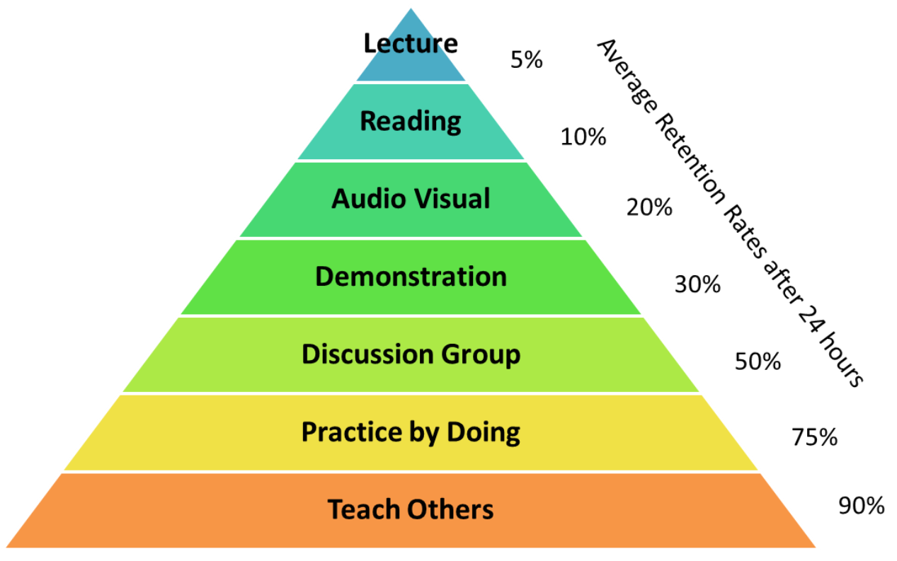
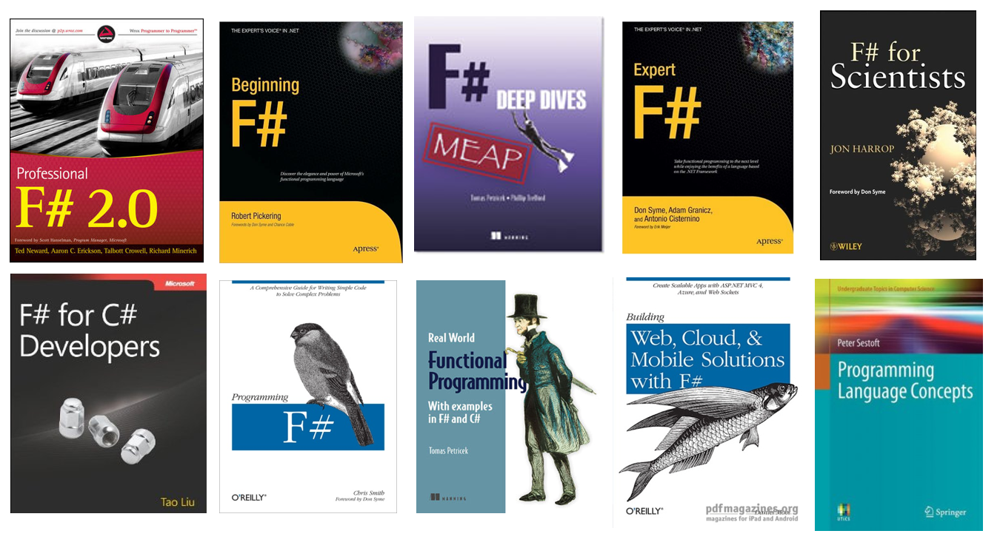

- title : Capturing domain logic in F#
- description : From types to domain specific languages
- author : Tomas Petricek
- theme : white
- transition : none

****************************************************************************************************

# Capturing domain logic in F#

## Closing notes

Tomas Petricek  
[www.fsharpworks.com](http://www.fsharpworks.com)

****************************************************************************************************

# CLOSING I

## Representing intent with F#

----------------------------------------------------------------------------------------------------

## Case I: Processing Markdown

_Pattern matching_ vs. _function composition_

## Case II: Decision trees

_Type_ for tree and _feature_ construction

## Case III: Recognizing patterns

_Internal representation_ vs. _public language_

## Case IV: Asynchronous and reactive

_Type_ captures what we can do

****************************************************************************************************

# CLOSING II

## Learning more about F#

---------------------------------------------------------------------------------------------------

non-profit _books and tutorials_

_cross-platform_ **community** data science

## F# Software Foundation

commercial support **open-source** _contributions_

machine learning **[www.fsharp.org](http://www.fsharp.org)** web and cloud

consulting  _user groups_ research

----------------------------------------------------------------------------------------------------

# The Learning Pyramid

----------------------------------------------------------------------------------------------------

# F# for Fun and Profit

## [www.fsharpforfunandprofit.com](http://fsharpforfunandprofit.com/)

Written by _fsharpWorks_ expert _Scott Wlaschin_

 - _Domain-driven development_ with F# types
 - Understanding _dependency cycles_ in C# and F#
 - _Low-risk ways_ to use F# in your work
 - ... and many other great articles!

Great material to read after the course

----------------------------------------------------------------------------------------------------

# F# Books and Resources

## [fsharp.org/about/learning.html](http://fsharp.org/about/learning.html)

----------------------------------------------------------------------------------------------------

# The F# Community

## Community chat and Q&A

 - **#fsharp** on Twitter  
   [twitter.com/hashtag/fsharp](https://twitter.com/hashtag/fsharp)
 - **FSSF** on Slack  
   [fsharp.slack.com](https://fsharp.slack.com)
 - **StackOverflow** F# tag  
   [stackoverflow.com/questions/tagged/f#](http://stackoverflow.com/questions/tagged/f%23)

----------------------------------------------------------------------------------------------------

# The F# Community

## Open source on GitHub

 - Microsoft **Visual F#** repo  
   [github.com/Microsoft/visualfsharp](http://github.com/Microsoft/visualfsharp)
 - **F# Compiler** and core libraries  
   [github.com/fsharp](http://github.com/fsharp/)
 - **F# Incubation** project space  
   [github.com/fsprojects](http://github.com/fsprojects/)
 - **FsLab** Organization repositor  
   [github.com/fslaborg](http://github.com/fslaborg/)
 - And numerous [private F# repositories](https://github.com/search?utf8=%E2%9C%93&q=f%23)

----------------------------------------------------------------------------------------------------

# User groups and F# events

## Visit your local F# user group!

Check the [user groups map](http://c4fsharp.net/groups.html)

## Some more F# events

[Open fsharp 2018](http://www.openfsharp.com) in San Francisco

[F# eXchange 2019](http://www.skillsmatter.com) in London 

[fsharpWorks trainings & workshops](http://www.fsharpworks.com) worldwide

----------------------------------------------------------------------------------------------------

# Thanks for attending

## Stay in touch!

_<i class="fa fa-envelope"></i>_ [info@fsharpworks.com](mailto:info@fsharpworks.com)  
_<i class="fa fa-twitter"></i>_ [@fsharpworks](http://twitter.com/fsharpworks)

_<i class="fa fa-envelope"></i>_ [tomas@tomasp.net](mailto:tomas@tomasp.net)  
_<i class="fa fa-twitter"></i>_ [@tomaspetricek](http://twitter.com/tomaspetricek)

****************************************************************************************************

## Agenda

 - [Introduction and why F#](index.html)
 - [The F# language foundations](1-intro.html)
 - [Domain modelling & decision trees](2-domain.html)
 - [Domain specific languages](3-dsls.html)
 - **Closing notes**
 